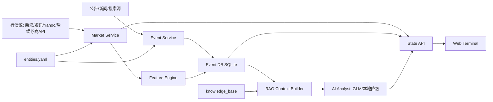
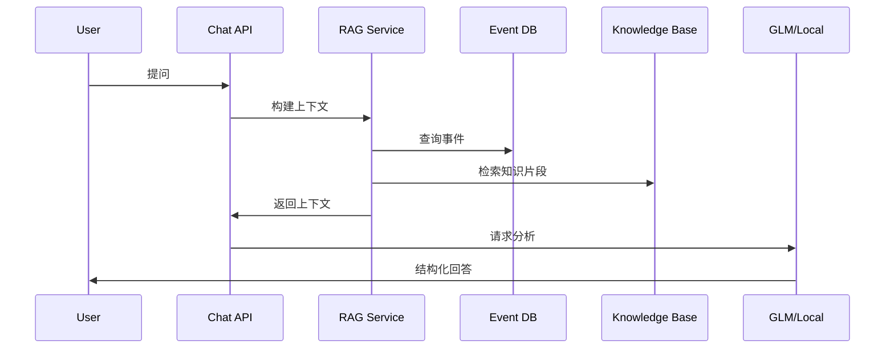
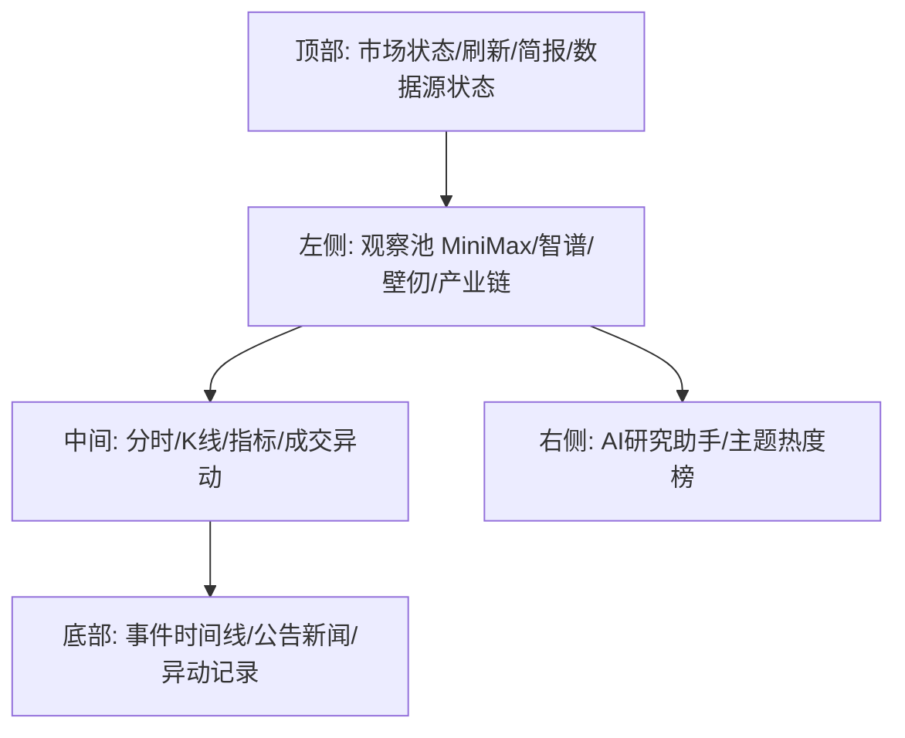

# 港股 AI/芯片主题研究终端：交付级软件图纸

## 1. 产品定位

产品名称：港股 AI/芯片主题研究终端

目标：把智谱、MiniMax、壁仞科技及其产业链做成一个可扩展的研究、监控、问答和简报工具。

边界：

- 做研究终端，不做自动交易。
- 做事实、事件、行情、技术面和 AI 辅助分析。
- 不把 AI 输出当作买卖指令。

## 2. 核心标的

| 实体 | 港股代码 | 类型 | 用途 |
|---|---:|---|---|
| MiniMax | 0100.HK | AI 大模型/应用 | 大模型商业化和应用观察 |
| 智谱 | 02513.HK | AI 大模型 | GLM、模型能力、商业化观察 |
| 壁仞科技 | 06082.HK | AI 芯片/GPU | 国产 GPU、算力芯片观察 |
| AI芯片产业链 | 待维护 | 产业链篮子 | 上游/封装/算力/服务器映射 |

所有实体都必须通过 `entities.yaml` 配置，不允许写死在业务代码里。

## 3. 总体架构



## 4. 后端模块设计

### 4.1 Config Service

职责：

- 读取 `entities.yaml`
- 管理实体、股票代码、关键词、别名、产业链标签
- 支持新增实体不改代码

交付文件：

- `entities.yaml`
- 后续可扩展 `watchlists.yaml`

### 4.2 Market Service

职责：

- 多股票实时行情
- 分时数据
- 日 K 数据
- 数据源失败自动降级
- 统一输出标准行情对象

标准输出：

```json
{
  "symbol": "0100.HK",
  "entity_id": "minimax",
  "realtime": {},
  "intraday": {},
  "kline": {},
  "technical": {},
  "status": "ok"
}
```

### 4.3 Feature Engine

职责：

- MA5/MA10/MA20
- BOLL
- MACD
- RSI
- 成交额放大
- 5/15/60 分钟异动
- 突破前高/布林上轨/均线

输出：

- 技术指标
- 异动事件
- 主题评分输入

### 4.4 Event Service

职责：

- 把新闻、公告、行情异动都转成事件
- 去重
- 分类
- 打重要性分
- 绑定实体和股票

### 4.4.1 Daily Knowledge Collector

职责：

- 每天自动收集关注实体的财报、公告、基本面新闻和重大事件。
- 写入 `knowledge_items` 表。
- 同步生成 `events`。
- 重建 `knowledge_base/zhipu_chunks.pkl`。
- 有 `ZHIPUAI_API_KEY` 时使用 GLM 联网搜索；没有 Key 时只维护本地实体画像，不伪装成联网结果。

采集范围：

- 财报、业绩公告、招股书、上市文件
- 港交所公告和公司公告
- 基本面新闻
- 产品发布
- 融资、合作、订单
- 监管和风险事件
- 市场异动解释材料

采集频率：

- 默认每天 07:00 后执行一次。
- 可通过 `DAILY_COLLECT_HOUR` 调整。
- 可通过 `COLLECT_DAYS` 控制回看天数。

注意：

- “全网所有资料”不可保证。
- 系统目标是覆盖权威来源和高价值来源，并保留来源 URL 以便追溯。

事件类型：

- 股价异动
- 技术突破
- 模型发布
- 产品发布
- 融资/上市
- 合作订单
- 财报公告
- 监管风险
- 产业链变化

### 4.5 RAG Service

职责：

- 本地知识库检索
- 最近事件检索
- 实时行情拼接
- 技术指标拼接
- 生成 AI 上下文

问答链路：



### 4.6 AI Analyst

必须支持两种模式：

- GLM 模式：有 `ZHIPUAI_API_KEY` 时调用智谱。
- Local 模式：无 Key 时使用本地规则摘要，但必须明确标注能力有限。

回答格式固定：

```text
核心结论
关键证据
行情/技术面
事件驱动
风险点
后续观察
```

不能再秒回固定模板。Local 模式也必须根据当前实体、事件、行情动态生成。

### 4.7 Report Service

职责：

- 生成日内简报
- 生成收盘简报
- 保存历史报告

输出文件：

```text
reports/YYYY-MM-DD.md
```

## 5. 前端设计



页面区域：

- 观察池：实体、代码、分数、状态
- 行情区：价格、涨跌幅、成交量、技术指标
- 图表区：分时、日K、MACD、成交量
- 热度区：主题评分和驱动因素
- 事件区：时间线
- AI区：研究问答

## 6. 主题评分模型

```text
主题分 = 行情强度 + 技术形态 + 事件强度 + 新闻热度 + 风险扣分
```

建议权重：

- 行情强度：30%
- 技术形态：20%
- 事件强度：25%
- 新闻热度：15%
- 风险扣分：10%

输出：

- 80-100：强关注
- 60-79：关注
- 40-59：观察
- 0-39：低热度

## 7. 数据库设计

### events

| 字段 | 用途 |
|---|---|
| id | 主键 |
| ts | 时间 |
| entity_id | 实体 |
| symbol | 股票 |
| source | 来源 |
| event_type | 类型 |
| title | 标题 |
| summary | 摘要 |
| url | 原文 |
| importance | 重要性 |
| impact | 正/负/中性 |
| payload_json | 扩展字段 |

### knowledge_items

| 字段 | 用途 |
|---|---|
| id | 主键 |
| collected_at | 采集时间 |
| event_date | 事件/新闻日期 |
| entity_id | 实体 |
| symbol | 股票 |
| source | 来源 |
| source_type | 财报/公告/新闻等类型 |
| title | 标题 |
| summary | 摘要 |
| url | 来源链接 |
| content | 正文/长摘要 |
| importance | 重要性 |

### snapshots

后续新增：

| 字段 | 用途 |
|---|---|
| ts | 时间 |
| symbol | 股票 |
| realtime_json | 行情 |
| technical_json | 指标 |

### reports

后续新增：

| 字段 | 用途 |
|---|---|
| report_date | 日期 |
| report_type | 类型 |
| content | Markdown 内容 |

## 8. API 设计

| API | 方法 | 用途 |
|---|---|---|
| `/api/state` | GET | 前端完整状态 |
| `/api/stocks` | GET | 股票行情 |
| `/api/entities` | GET | 实体配置 |
| `/api/events` | GET | 事件列表 |
| `/api/report` | GET | 生成简报 |
| `/chat` | POST | 研究助手 |

## 9. 交付阶段

### V1：可用研究终端

- 三个核心标的均显示行情
- 多实体观察池
- 分时/K线
- 技术指标
- 事件库
- 本地 AI 分析
- GLM 可选增强

### V2：专业事件系统

- 新闻抓取
- 公告抓取
- AI 事件分类
- 事件去重
- 事件影响评分

### V3：研究自动化

- 日报
- 收盘复盘
- 异动解释
- 主题对比
- 历史评分曲线

### V4：准投研工作台

- 财报数据
- 估值指标
- 竞品对比
- 产业链图谱
- 自定义股票池

## 10. 当前必须修改的问题

1. MiniMax 和壁仞已经有港股代码，必须填入 `entities.yaml`。
2. AI 助手不能只返回模板，必须读取：
   - 当前实体
   - 当前股票
   - 实时行情
   - 技术指标
   - 最近事件
   - 本地知识库
3. 每日采集必须自动更新 `knowledge_items`、`events` 和 `knowledge_base`。
4. Local 模式要动态生成，不许假装联网。
5. GLM 模式要在没有 Key 时明确提示，不许静默退化。
6. 前端要显示数据源状态和错误原因。

## 11. 验收标准

交付时必须满足：

- MiniMax、智谱、壁仞都能出现在观察池。
- 已配置股票代码的实体都能显示价格。
- 点击任意实体，图表、事件、AI 上下文同步切换。
- AI 回答包含当前标的真实行情字段。
- 每天自动采集后，知识库 chunks 会更新。
- 没有 Key 时不会伪装成联网 AI。
- 事件库可持久化。
- 新增公司只改配置，不改业务代码。
