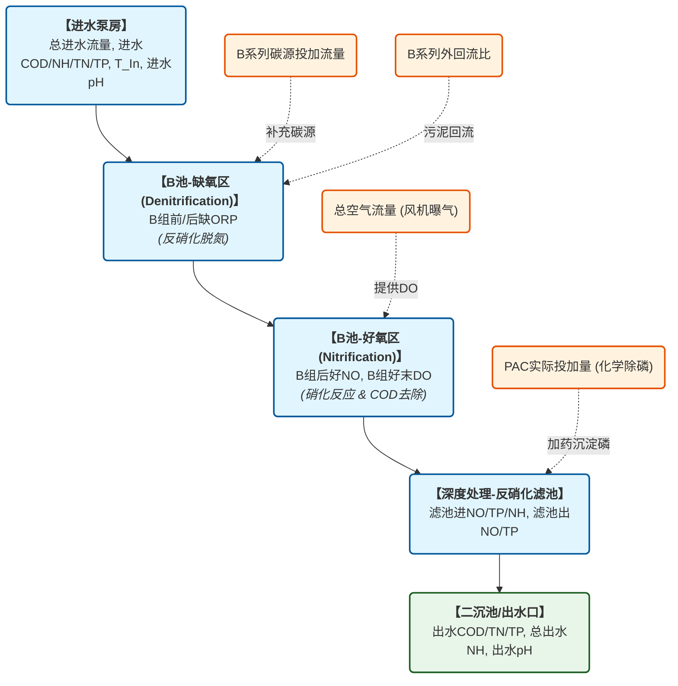

# 东阳污水处理厂数据分析与 AI 算法场景规划报告

本报告针对东阳污水处理厂提供的两个核心数据集（[中控运行记录.csv](file:///e:/PY/射阳城北污水处理厂/东阳水厂/中控运行记录.csv) 与 [JLHJ-01 运行月汇总表.xlsx](file:///e:/PY/射阳城北污水处理厂/东阳水厂/JLHJ-01%20运行月汇总表.xlsx)）进行了深入的数据探索与挖掘，并结合水厂工艺（碳源投加、化学除磷、曝气能耗、水质预警等）设计了具体可落地的 AI 算法与数据挖掘方案。

---

## 1. 数据资产画像

经过对本地数据的提取与预分析，我们对水厂的数据资产进行了画像定位：

### 1.1 中控 SCADA 实时运行数据 ([中控运行记录.csv](file:///e:/PY/射阳城北污水处理厂/东阳水厂/中控运行记录.csv))
* **时间范围**：`2026-02-05 21:36:00` 至 `2026-04-02 20:16:00`（共计约 **56 天** 的连续运行数据）。
* **数据规模**：**13,764 条记录**，共有 **26 个特征维度**（包含进出水质、工艺段中间态、控制变量）。
* **采样频率**：极高且规则，**97.8% 的数据为 5 分钟等间距采样**，非常适合做高频时间序列建模。
* **数据质量**：**缺失值为 0.00%**。这在工业历史数据中属于极高质量的“黄金数据集”，免去了复杂的插值清洗步骤。
* **主要监测变量**：
  * **进水指标**：`总进水`（流量）、`进水COD`、`总进水NH`（氨氮）、`进水TN`（总氮）、`进水TP`（总磷）、`进水PH`、`T_In`（进水水温）。
  * **生化中间态**：`B组好末DO`（溶解氧）、`B组后好NO`（硝态氮）、`B组前缺ORP`、`B组后缺ORP`（氧化还原电位）、`总空气流量`（曝气量）、`B系列外回流比`。
  * **深度处理段**：`反硝化滤池进/出NO`、`反硝化滤池进/出TP`、`反硝化滤池进NH`。
  * **出水指标**：`出水COD`、`总出水NH`、`出水TN`、`出水TP`、`出水PH`。
  * **关键加药控制**：`B系列碳源投加流量`、`PAC实际投加量`。

### 1.2 宏观运行月汇总数据 ([JLHJ-01 运行月汇总表.xlsx](file:///e:/PY/射阳城北污水处理厂/东阳水厂/JLHJ-01%20运行月汇总表.xlsx))
> [!NOTE]
> 该文件虽以 `.xlsx` 结尾，但底层实际为 Excel 97-2003 的 `.xls` 复合二进制文档格式。
* **数据结构**：包含 34 个 Sheet 表格。其中：
  * **东阳污水厂**：Sheet `25.1` 至 `25.12`（对应 2025 年 1-12 月，每日一条记录，包含日处理水量、日动力电量、总电量、日混凝剂 PAC 消耗量、絮凝剂 PAM 消耗量、产泥量、污泥含水率等）。
  * **桥北污水厂**：Sheet `1.20` 至 `11.28` 等为桥北污水处理厂的日运行数据（可用于做跨厂的迁移学习或多厂对比分析）。

---

## 2. 污水处理工艺与数据参数映射

为了让算法模型符合污水处理的生化机理，我们将 SCADA 数据中的 26 个字段映射到污水处理的核心工艺流程中：

---

## 3. 核心 AI 算法场景规划

基于上述数据，我们规划了以下 5 个可落地的 AI 数据挖掘与模型场景：

### 场景一：智能除磷加药优化控制 (PAC Dosage Optimization)
* **业务痛点**：PAC（聚合氯化铝）是化学除磷的主要药剂。目前水厂多采用人工经验加药或按比例加药，容易导致**出水 TP 波动**，且为保证达标往往存在**过度投加**，造成药剂浪费和污泥产量增加。
* **算法方案**：**前馈预测 + 反馈调节模型 (Feed-forward + Feedback Control)**
  1. **前馈预测**：使用 `XGBoost` 或 `LSTM` 建立 PAC 投加预测模型。输入当前和历史滞后的 `总进水`、`反硝化滤池进TP`、`进水COD`，预测在目标出水 TP 约束下（如出水 TP < 0.08 mg/L）所需的最小 `PAC实际投加量`。
  2. **数字孪生仿真**：训练一个多层感知机 (MLP) 或 LSTM 模拟器，输入 `(当前进水TP, 当前PAC投加量, 进水流量, 历史出水TP)`，预测 $t+15$ 分钟后的 `反硝化滤池出TP`。然后利用遗传算法 (GA) 在仿真器中搜索，寻找既能使出水 TP 达标又能使 PAC 投加量最小的控制参数。

### 场景二：智能外加碳源精准投加 (Smart Carbon Source Control)
* **业务痛点**：反硝化生化脱氮需要消耗碳源（通常为甲醇、乙酸钠等）。若碳源投加不足，出水总氮 (TN) 超标；投加过量则出水 COD 升高，且碳源成本极高（占水厂药剂成本的 50% 以上）。
* **算法方案**：**强化学习 (RL) 或 变结构控制模型**
  * **特征工程**：将 `总进水`、`T_In`（温度对反硝化速率影响极大）、`B组后好NO`（前级送来的硝态氮负荷）、`B组后缺ORP`（缺氧环境指示）以及 `反硝化滤池进NO` 组合为状态向量 $S$。
  * **预测建模**：构建 LSTM 时间序列回归模型，建立控制决策 `B系列碳源投加流量` 与未来的 `反硝化滤池出NO`、`出水TN` 的动态响应曲线。
  * **动态加药策略**：利用滚动优化 (MPC) 机制，根据未来 1 小时预测的 TN 负荷，动态给出最优的碳源加药流量，实现精准脱氮。

### 场景三：出水水质超标多步预警 (Effluent Water Quality Early Warning)
* **业务痛点**：污水在水厂内的水力停留时间 (HRT) 长达数小时，当进水水质出现冲击（如工业废水突排）时，SCADA 实时参数虽发生变化，但等出水口仪表报警时，超标废水已排出，无法挽回。
* **算法方案**：**多步长时序预测算法 (Multi-Step Time-Series Forecasting)**
  * **网络结构**：基于 `LSTM`、`GRU` 或 `Temporal Fusion Transformer (TFT)` 建立时间序列预测模型。
  * **目标变量**：预测未来 $t+1\text{小时}$、$t+2\text{小时}$、$t+4\text{小时}$ 的 `出水TN`、`出水TP`、`总出水NH`、`出水COD`。
  * **应用机制**：当模型预测到 2 小时后出水 TN 或 TP 有超标风险时，联动报警系统并提供协同调控建议（如“建议调大碳源投加量 15%”或“提高总空气流量”）。

### 场景四：曝气系统能耗优化与 DO 软测量 (DO & Aeration Optimization)
* **业务痛点**：曝气风机是水厂的“电老虎”（占整厂能耗的 50% 以上）。好氧区溶解氧 (DO) 偏低会影响硝化反应导致氨氮超标；DO 过高则风机能耗空耗，且大回流会将过多 DO 带入缺氧区破坏反硝化。
* **算法方案**：**DO 动力学预测与风机频率关联模型**
  * **DO 软测量与预测**：以 `总空气流量`（控制量）、`总进水NH`（负荷）、`总进水`（流量）和 `T_In`（水温影响饱和溶解氧）为输入，构建 `B组好末DO` 的预测模型。
  * **曝气节能控制**：寻找 DO 的最佳控制域（如平衡在 1.5 - 2.0 mg/L 之间），当硝化负荷下降时，模型计算出可降低的 `总空气流量` 目标值，指导鼓风机实施变频节能运行。

### 场景五：日能耗与药耗宏观数字面板与效率诊断 (Macro Energy & Chemical Cost Profiling)
* **业务挖掘**：结合 [JLHJ-01 运行月汇总表.xlsx](file:///e:/PY/射阳城北污水处理厂/东阳水厂/JLHJ-01%20运行月汇总表.xlsx) 中 2025 年全年的日汇总数据。
* **算法方案**：**多元线性回归 / 聚类分析 / 异常检测**
  * **效能基准面建立**：建立 `处理水量` vs `总电量`、`处理水量` vs `PAC实际消耗量` 的非线性效能基准面（Baseline）。
  * **异常运营诊断**：利用 `孤立森林 (Isolation Forest)` 识别单位耗电量偏离基准的异常天，分析是由于天气原因（暴雨期水量激增）、泥龄控制问题，还是设备故障（如风机空转）引起的，为管理层提供精细化成本控制决策。

---

## 4. 关键运行趋势可视化

为了直观展示数据中蕴含的控制规律，我们绘制了 SCADA 数据中 3 天样本窗口的参数波动趋势图：

### 数据特征观察与挖掘洞察：
1. **化学除磷 (PAC)**（第一幅图）：
   * 进水 TP（蓝色）在 4.0 ~ 8.0 mg/L 之间剧烈波动，但经过 PAC 加药和沉淀过滤后，出水 TP * 10（红线，即实际出水 TP 在 0.05 ~ 0.15 mg/L 之间）得到了稳定控制，表现出极强的去污效果。
   * **挖掘点**：PAC 实际投加量（橙色阴影）呈现阶梯式变化，与进水 TP 的高频波动并不完全契合，说明控制存在**滞后性**。可以通过预测进水 TP 负荷来实现“超前加药”，减少出水 TP 的微小抖动，并降低药剂总量。
2. **生物脱氮 (碳源)**（第二幅图）：
   * 滤池进硝态氮（绿色）和滤池出硝态氮（紫色）表现出日周期性波动。伴随着 B 系列碳源投加（绿色阴影）的调整，滤池出 NO 得到了有效削减。
   * **挖掘点**：分析碳源投加与总氮削减率之间的动态响应时间常数（Delay Time），这是建立精准时序反馈模型（如带外源输入的 ARIMAX 或 LSTM）的关键。
3. **曝气DO控制**（第三幅图）：
   * 溶解氧 DO（蓝色）与总空气流量（红色虚线）有明显的**负相关/滞后跟随**特征。当空气流量维持高位时，DO 往往跟随上升；当空气流量为 0 时，DO 迅速跌落。
   * **挖掘点**：DO 随空气流量的变化存在约 15~30 分钟的物理传递延迟，可通过建立时序延迟回归模型（Time-lagged Regression）来实现曝气风机的超前变频调节。

---

## 5. 下一步实施建议

> [!TIP]
> 鉴于中控 SCADA 数据（5分钟分辨率、无缺失值、字段齐全）和日汇总数据极其完整，我们建议分阶段实施以下算法：

| 阶段 | 核心任务 | 推荐算法 | 预期收益 |
| :--- | :--- | :--- | :--- |
| **第一阶段** (基础时序挖掘) | **出水水质预测与异常超标预警** 预测未来 1-4 小时的 TN, TP, NH | LSTM / GRU / LightGBM | 提前发现潜在超标风险，告别事后被动报警 |
| **第二阶段** (药剂精细化控制) | **PAC/碳源智能加药推荐系统** 根据进水指标推荐当前最优加药量 | 负荷预测 + PID/MPC 反馈调节 / XGBoost 回归 | 预计可为水厂节省 **8% - 15%** 的化学药剂采购成本 |
| **第三阶段** (能耗闭环优化) | **曝气DO闭环变频节能算法** 风机空气流量与DO的动态匹配 | 软测量模型 + 强化学习/多目标寻优 | 预计可为鼓风机运行节省 **5% - 12%** 的动力电耗 |

您本地的 `LSTM` 环境包含了做时间序列建模（如 PyTorch / TensorFlow / Keras）的完整环境，我们完全可以直接在此环境中基于 `PyTorch` 或 `Scikit-Learn` 编写模型训练和验证代码。
