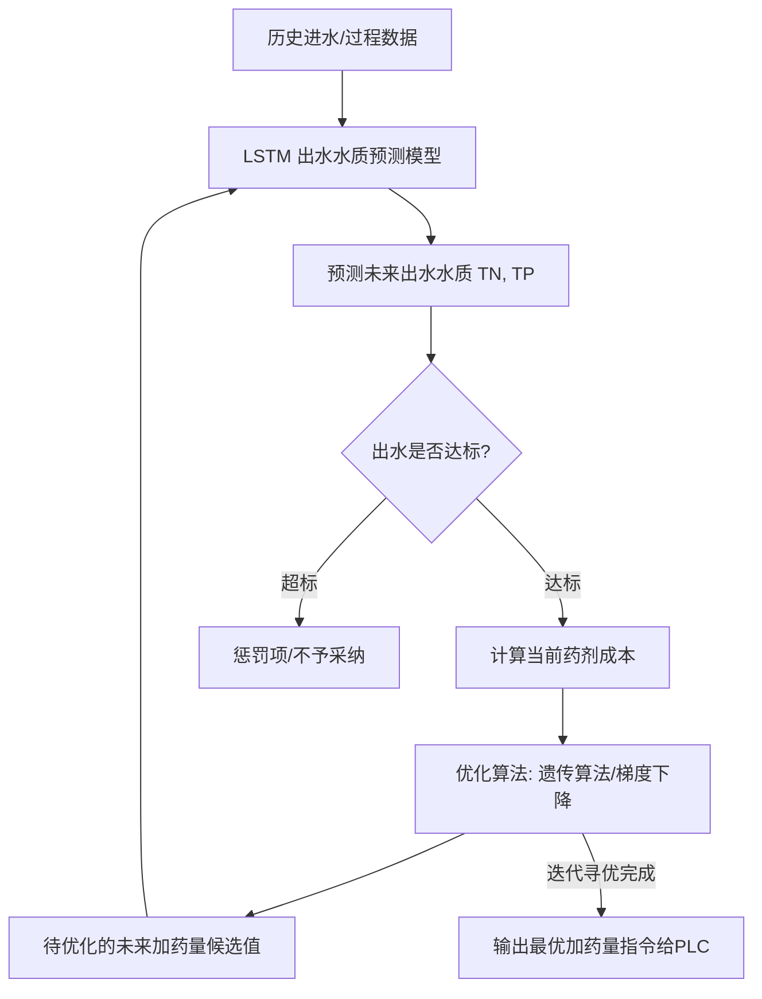

# 污水处理厂精确加药人工智能模型可行性分析报告

本项目旨在基于人工智能模型（如LSTM长短期记忆神经网络）实现污水处理厂的“精确加药”控制。通过对企业提供的工艺文档、SCADA系统截图以及2026年1-4月的历史小时水质数据进行深度分析，本报告评估了精确加药的可行性，确定了可控药剂范围，指出了目前的数据缺口，并给出了具体的技术实施路线。

---

## 一、 核心结论与可行性评估

使用人工智能模型（特别是**LSTM神经网络**）进行精确加药控制是**完全可行且具有显著经济效益**的。

### 1. 为什么传统的反馈控制（PID）难以满足精确加药？
* **大滞后性（Large Time Delay）**：污水处理流程（如改良 A2O 生化池）的水力停留时间（HRT）通常长达 8~15 小时。这意味着，如果仅根据出水超标（反馈）来增加加药量，超标的废水早已排出；而如果盲目过量投加，又会造成药剂浪费、增加污泥产量并提高运行成本。
* **非线性与时变性（Non-linearity & Time-varying）**：进水流量 and 浓度具有明显的日波动和季节性变化，且活性污泥中的微生物活性强烈依赖于水温、溶解氧（DO）和酸碱度（pH）。

### 2. 为什么 LSTM 模型适合该场景？
* **时序建模能力**：LSTM 能够记忆长期的历史状态，非常适合模拟具有大滞后、惯性特征的污水处理物理化学过程。
* **延迟自适应**：模型可以通过输入过去 12~24 小时的时序数据，预测当前和未来数小时的出水指标，从而实现**前馈+反馈（Feedforward-Feedback）**的智能预测控制。
* **本地开发环境就绪**：本地已具备基于 Conda 的 LSTM 运行环境，可直接进行模型训练与验证。

---

## 二、 三种主要药剂的控制可行性分析

根据工艺图纸和现场监控数据，水厂主要投加三种药剂：**碳源（乙酸钠）**、**除磷剂（PAC）**和**消毒剂（次氯酸钠）**。

| 药剂名称 | 主要控制目标 | 投加位置 | 控制原理与可行性 |
| :--- | :--- | :--- | :--- |
| **乙酸钠（碳源）** | 出水总氮（TN） $\le 15 \text{ mg/L}$ | 生化池（缺氧区）、深床滤池（反硝化段） | **可行性高**。通过预测反硝化过程中的碳源缺口，动态调整投加量。需要结合反硝化动力学和时序模型。 |
| **PAC（聚合氯化铝）** | 出水总磷（TP） $\le 0.5 \text{ mg/L}$  辅助降低出水悬浮物（SS） | 二沉池前、深床滤池进水配水井 | **可行性高**。化学除磷反应极快，主要根据进水TP负荷及二沉池/滤池的沉淀过滤效率预测投加量，属于典型的物化反应控制。 |
| **次氯酸钠（消毒剂）** | 出水粪大肠菌群、余氯指标 | 接触消毒池 | **中等可行**。主要依据出水瞬时流量和水质有机物浓度（COD、氨氮等消耗氯的物质）进行前馈投加，并根据余氯反馈微调。 |

---

## 三、 基于现有数据的分析与控制边界

我们对 `3.数据端/2026.1-4月小时数据` 中 120 天（共 2880 条完整小时记录）的进出水数据进行了整理，统计结果如下：

### 1. 1-4月水质数据统计摘要

| 指标 (单位: mg/L, pH除外) | 进水均值 | 进水最大值 | 出水均值 | 出水最大值 | 国家一级A标准限值 |
| :--- | :--- | :--- | :--- | :--- | :--- |
| **化学需氧量 (COD)** | 124.33 | 2104.70 | 10.31 | 422.80 | 50 |
| **氨氮 (NH3-N)** | 22.61 | 52.96 | 0.14 | 7.85 | 5 (冬季为8) |
| **总氮 (TN)** | 29.71 | 54.86 | 7.23 | 16.00 | 15 |
| **总磷 (TP)** | 2.86 | 10.47 | 0.04 | 0.65 | 0.5 |
| **温度 (temp, ℃)** | 16.78 | 22.60 | 15.28 | 19.80 | - |
| **pH** | 7.35 | 8.00 | 6.72 | 7.00 | 6~9 |
| **流量 (flow, t/h)** | 186.26 | 423.00 | 185.01 | 272.00 | 设计规模 1.0万 t/d |

### 2. 基于现有数据可开展的工作
现有数据包含了完整的**进水水质指标**、**出水水质指标**、**水温**和**处理流量**。利用这些数据，可以开展以下模型建立：
1. **出水指标预测模型**：建立 `进水历史时序数据 -> 出水指标(TN, TP, COD)` 的预测模型。
2. **加药量估算模型（机理公式辅助）**：基于质量守恒定律，利用进出水浓度差和流量，计算理论所需的最低加药量。

---

## 四、 核心缺失数据清单（急需补充）

**目前最大的局限在于：我们没有任何历史加药量的数据，也没有关键的工艺中间过程参数。**
要训练出实用的 AI 精确加药模型，必须向厂方索取并补充以下数据：

### 1. 历史加药量时序数据（最核心）
没有这部分数据，AI 模型无法建立“投加量”与“出水水质”之间的因果关联。
* **生化池乙酸钠投加流量** (L/h 或 kg/h) - 对应时间戳
* **滤池乙酸钠投加流量** (L/h 或 kg/h) - 对应时间戳
* **PAC 投加流量** (L/h 或 kg/h) - 对应时间戳
* **次氯酸钠投加流量** (L/h 或 kg/h) - 对应时间戳
* *注：如果是记录加药泵频率 (Hz)，则必须同时提供该频率对应的实际泵投加流量流量换算曲线（或者确认加药泵行程开度未曾人为改变）。*

### 2. 工艺过程状态参数（提升预测精度）
生化池内的反应状态决定了药剂的实际消耗效率，以下参数对于碳源和除磷控制至关重要：
* **好氧池溶解氧 (DO)** (mg/L) & **缺氧池氧化还原电位 (ORP)** (mV)
  > 缺氧区的 DO 如果过高（比如由内回流携带过多元气），会直接消耗乙酸钠，使碳源利用率下降。
* **生化池污泥浓度 (MLSS)** (g/L)：代表反应器内的微生物总量，决定了硝化与反硝化速率。
* **内回流流量/回流比** & **外回流流量/回流比**：决定了硝态氮进入缺氧区的速率以及污泥的流失与补充。

### 3. 其他辅助参数
* **出水余氯** (mg/L) 或**出水粪大肠菌群**：用于次氯酸钠投加效果的闭环反馈控制。
* **深床滤池反冲洗状态与周期**：反冲洗时滤池的拦截效率会发生瞬时改变，影响 TP 和 SS。

---

## 五、 精确加药控制系统实施方案（LSTM + MPC）

推荐采用**模型预测控制（Model Predictive Control, MPC）**框架结合 LSTM 神经网络来实现精确加药：

### 实施步骤：
1. **数据清洗与校准**：去除异常值（如进水 COD 2104 mg/l 突变值，需判断是仪表故障还是真实工业废水负荷），进行多变量时序对齐，补全缺失时间戳。
2. **LSTM 延迟对齐训练**：
   * 将输入特征设为：$[Flow(t), COD_{in}(t), TN_{in}(t), MLSS(t), Temp(t), Dosing(t)]$
   * 输出目标为：$TN_{out}(t + \Delta t)$，其中 $\Delta t$ 为水力停留延迟（可以通过互相关分析 Cross-Correlation 确定最佳延迟步长）。
3. **算法闭环部署**：
   * 在本地 Conda 的 LSTM 环境完成模型训练，将模型保存为 PyTorch `.pt` 或 TensorFlow `.h5` 格式。
   * 编写控制脚本，通过 OPCDA / ModbusTCP 协议实时读取中控 SCADA 的进水及过程数据，运行 LSTM 预测，并利用优化算法寻找最省药且安全的加药值，最后将该加药值（泵频率）写入 PLC。

---

## 六、 后续行动建议

1. **联系水厂工程师**：导出 2026年1-4月（与现有水质数据同一时期）的**加药泵运行记录（频率、瞬时投加流量）**和**生化池工艺运行数据（MLSS, DO, 回流比）**。
2. **开展跨时序相关性分析**：拿到数据后，首先分析进水负荷与加药量之间的动态响应时间差，为 LSTM 模型的滑动窗口大小（Window Size）和预测步长（Horizon）提供依据。
3. **开发原型脚本**：基于现有 2880 条进出水数据，先搭建一个出水 TN 预测的 LSTM 基准模型，验证时序网络在本地 Conda 环境下的训练效率。
